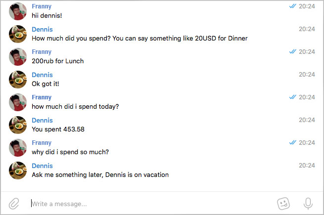

[](https://travis-ci.org/fmitra/dennis-bot) [](https://goreportcard.com/badge/github.com/fmitra/dennis-bot) [](https://codecov.io/gh/fmitra/dennis-bot)

# Dennis

A pet project to learn Go, Dennis is a privacy friendly Telegram bot to manage expense tracking. Talk to him [here](https://t.me/AssistantDennisBot)



## Overview

Dennis was written as a way to track international expenses in a single currency. He keeps an encrypted log
of international expenses and returns the total (daily, weekly, monthly) in the user's preferred currency.
At the moment, he suppoorts the following commands:

* Track an expense

```
format: <integer_amount><currency_iso> for <description>

example: 200RUB for Lunch
```

* Get expense history

```
format: how much did I spend <time_period> (today, this week, this month)

example: How much did I spend today?
```

### Privacy Friendly But Be Warned

While Dennis respects your privacy, **he's not intented to store confidential data**. His primary
use case is to offer a **convenient** way to follow up on your day to day spending. In short,
he protects you from himself - the bot owner cannot access your detailed expenditures, or
use your information for advertising. Anyone with access to your device however can **easily**
access or request this info.

#### Data protection

Dennis creates a private/public key pair for all users to encrypt most details of their expenses
(note: timestamps are unencrypted). Your private key is protected with a password of your choice.
This ensures the admin running the bot has no zero access to your expenditures.

While this protect's user data from the bot owner, keep in mind passwords are visible in
plaintext right inside of the Telegram application. Anyone who has access to your chats for
instance, can grab hold of your expense history.

#### Logging

With the exception of error logging, there are no logs set up to identify incoming or outgoing
chat history between the user and Dennis.

## Developer Dependencies

* [Ngrok](https://ngrok.com/downlaod)
* Postgres & Redis or [Docker](https://www.docker.com/)

## Getting Started

You will need API key's for the following services to get started.

* [Telegram Auth Token](https://core.telegram.org/bots/api#authorizing-your-bot)
* [Alphapoint API Key](https://www.alphapoint.com/api/index.html)
* [Wit.ai API Key](https://wit.ai)

#### 1. Set up development environment

The test suite requires Postgres and Redis to be set up as well as a valid
configuraiton file. The `config.example.json` file is already prepared to use the
default settings in the sample `docker-compose.example.yml`.

The command below will generate a test config and spin up docker and redis

```
make develop
docker-compose up -d
```

This project uses `Dep` for dependency mangagement and `Megacheck` and `golint` as a linter.
If these packages are not installed on your system, run:

```
make dev_dependencies
```

Otherwise just install the app's third party packages.

```
dep ensure -vendor-only -v
```

#### 2. Confirm tests are passing

Note, test packages are dependent on a local shared DB. They must be run sequentially
with `-p=1` to prevent race conditions during teardown methods.

```
go test -p=1 ./...
```

You can also run vet, golint, megacheck and test (with race check and cache disabled) using the command below.

```
make test_and_lint
```

#### 3. Run Ngrok and set up your local `config.json`

These steps are not necessary if all you want to do is run the test suite.

##### Expose local port to web

```
./ngrok http 8080
```

##### Update settings

* `database` and `reddis` - Postgres & Redis settings if you are not using the default test config
* `telegram` - Telegram API token to respond to messages
* `wit` - Wit.ai auth token to parse user messages
* `alphapoint` - Alphapoint API key to convert currency
* `bot_domain` - Domain the bot will be receiving webhooks from. In development, this will be the Ngrok URL


#### 5. Run the bot

```
go build ./cmd/dennis-bot
./dennis-bot
```

## Developer Notes

#### Telegram Authentication

Telegram does not send any authentication headers in their requests, and instead recommends
you instead use the token as the path of your webhook.


#### Docker

Tagged builds are available on [docker hub](https://hub.docker.com/r/fmitra/dennis-bot/tags/). They sould be configured with an environment variable
`DENNIS_BOT_CONFIG` that points to a JSON config on a local volume.
